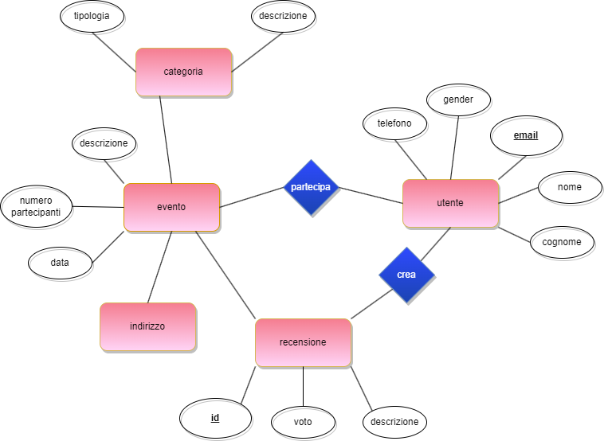
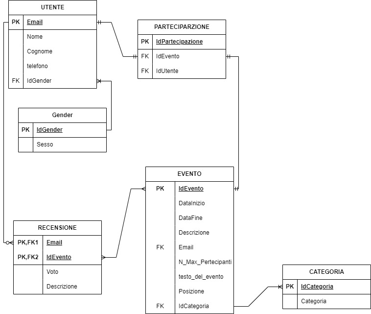
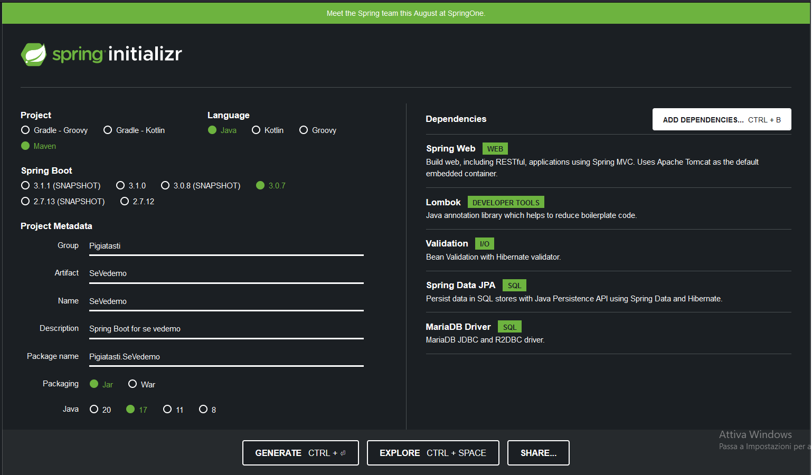
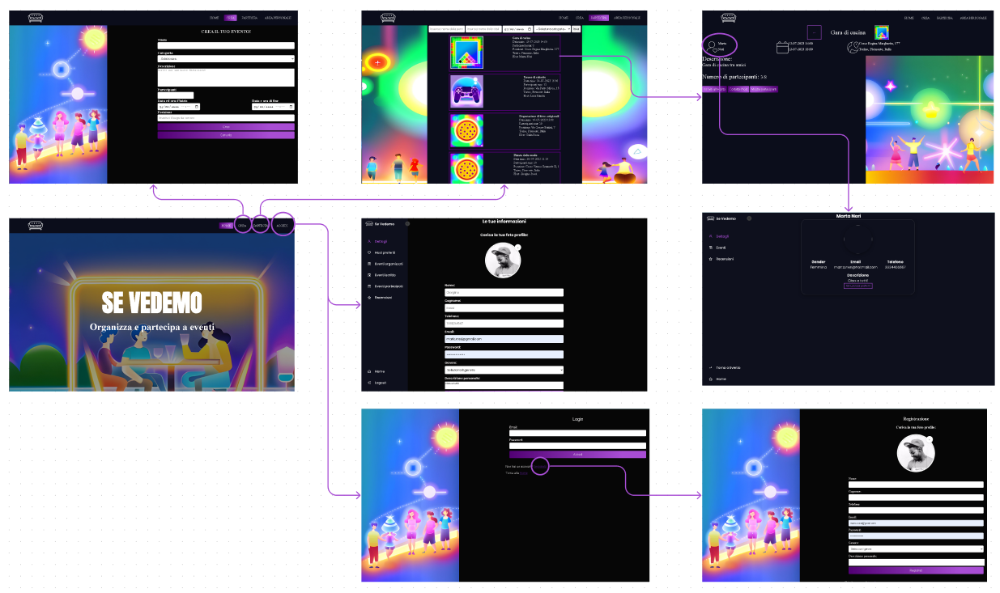
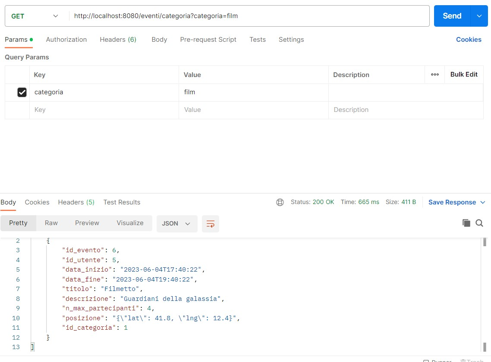

# Team Name: PIGIATASTI

## User Requirements

### Aggregatore Sociale

La nostra azienda desidera creare una piattaforma che funga da aggregatore sociale, permettendo ai nostri dipendenti di organizzare eventi e di invitare conoscenti o estranei a partecipare. La piattaforma richiesta deve consentire all'organizzatore di creare un nuovo evento di un determinato "tipo" (ad esempio "Serata cinema", "Serie TV", "Giochi di ruolo", "Videogiochi", "Pizza"...) indicando le seguenti informazioni base:

- Tipologia di evento
- Indirizzo
- Giorno
- Fascia oraria
- Numero massimo di partecipanti

Ad esempio, se sto organizzando una serata Pizza a casa mia, in Piazza Statuto 1, il 9 settembre 2023, posso ospitare al massimo 4 persone.

Inoltre, la piattaforma deve consentire a chi cerca un evento di effettuare una ricerca per filtri ed eventualmente iscriversi ad un evento che gli interessa.

Per soddisfare queste esigenze, si richiede lo sviluppo di una Web Application utilizzando Java, preferibilmente Spring/Spring Boot, a microservizi (tutti servizi REST), conun'interfaccia grafica. È richiesta la consegna della documentazione tecnica di quanto sviluppato e di un manuale utente per semplificare l'approccio iniziale degli utenti.

Siamo inoltre interessati a proposte per la scelta di un naming e di un logo per la piattaforma.

La data del primo appuntamento per la presentazione dell'idea iniziale è fissata per il 5 giugno 2023, mentre l'eventuale incontro per l'avanzamento dei lavori è fissato per il 30 giugno 2023. La presentazione finale ai dipendenti è prevista per il 14 luglio 2023.

## Documentation

### SRUTTURA DATABASE

il primo passo è stato creare il db per sodisfare gli UR abbiamo ideato la seguente struttura:

#### Schema logico

#### Schema E/R

## Query database

### per le repository usiamo le seguenti query

- select * from categoria c -> elenco dei record di tutte le categorie

- select * from evento e -> elenco dei record di tutti gli eventi

- select * from partecipazione -> elenco dei record di tutte le partecipazioni

- select * from recensione r -> elenco dei record di tutte le recensioni

- select * from utente u -> -> elenco dei record di tutti gli utenti

### stored procedure usate

- sp_DeleteEventoByIdUtente->BEGIN
  DECLARE v_Count INT; SET p_IsDeleted = FALSE;    SET v_Count = (SELECT COUNT(*)FROM evento WHERE id_evento = p_Id); IF v_Count > 0 THEN        DELETE FROM evento WHERE id_evento = p_Id; SET p_IsDeleted = TRUE; END IF;END

  (questa stored procedure conta gli eventi dando un id e se l' elemento esiste viene eliminato)

- sp_GetRecensioniByEmail->BEGIN SELECT r.descrizione AS 'Recensione', r.voto AS 'Voto', u.email AS 'Autore recensione', e.titolo AS 'Evento' FROM utente u JOIN recensione r ON r.id_utente = u.id_utente JOIN evento e ON e.id_evento = r.id_evento WHERE u.email = p_Email; END

    (restituisce un elenco delle recensioni degli eventi scritte dall'utente specificato, insieme alle informazioni sull'evento e sull'autore della recensione.)

- sp_GetListaEventiUtente->BEGIN SELECT e.id_evento, .id_partecipazione, u.email, u.nome, u.cognome, e.titolo as       'Evento', e.descrizione as 'Descrizione evento', e.n_max_partecipanti     as 'Numero massimo partecipanti', e.posizione, e.data_inizio,         e.data_fine, c.categoria as 'Categoria evento' FROM utente u JOIN partecipazione p ON p.id_utente = u.id_utente JOIN evento e ON p.id_evento = e.id_evento JOIN categoria c ON c.id_categoria = e id_categoria WHERE u.email = p_Email;END

    (restituisce un elenco di eventi a cui l'utente specificato ha partecipato o si è iscritto, insieme alle informazioni sull'evento e sulla categoria a cui appartiene.)

- sono presenti delle stored procedure per la ricerca degli evevent in questo caso dei filtri sui campi della tabella eventi in questo caso per il nome di chi ospita l' evento-> BEGIN DECLARE nome_host TEX  SELECT CAST(e.id_evento AS INT) AS id_evento,     e.titolo,     c.categoria,     e.data_inizio,     e.data_fine,     e.descrizione,     CAST(e.n_max_partecipanti AS INT) AS n_max_partecipanti,     sp.nome AS nome_host,     CAST(COUNT(p.id_partecipazione) AS INT) AS numero_partecipanti,     e.posizione FROM evento e     LEFT JOIN partecipazione p ON e.id_evento = p.id_evento     JOIN categoria c ON e.id_categoria = c.id_categoria     JOIN (         SELECT DISTINCT e.id_utente, u.nome         FROM evento e         JOIN utente u ON e.id_utente = u.id_utente     ) AS sp ON e.id_utente = sp.id_utente GROUP BY e.id_evento, e.titolo;
END

    (restituisce un elenco di tutti gli eventi creati dallo stesso host)

### Per altri utilizzi
<!--Da scrivere documentazione-->

- Numero partecipanti attuale -> SELECT COUNT(*) FROM `partecipazione` WHERE `id_evento`=*input*

- Numero partecipanti max -> SELECT `n_max_partecipanti` FROM `evento` WHERE `id_evento`=*input*

- Nome Organizzatore -> SELECT u.nome,u.cognome FROM `evento` e INNER JOIN utente u on e.id_utente=u.id_utente WHERE `id_evento`=*input*

- Foto profilo organizzatore -> SELECT `foto` FROM `utente` WHERE `id_utente`=*input*

- Eventi attuali -> SELECT * from evento where `data_fine` > CURDATE()

### Backend
<!--Provide more information on the backend implementation, including project structure, key classes, and component interactions.-->

il secondo passo è stato creare lo spring initializr, secondo le dependencies che ci sarebero servite e rese utili:

- Spring web(Spring Web è una parte di Spring Boot che ti aiuta a gestire la parte del sito web che viene mostrata ai clienti.)
- Lombok(Lombok è una libreria open source per il linguaggio di programmazione Java che ti aiuta a scrivere codice più pulito e conciso. Lombok ti aiuta a risparmiare tempo e rendere il tuo codice più leggibile e compatto, fornendoti degli strumenti che automatizzano queste attività ripetitive)
- Validation (Hibernate Validation è una libreria open source per la validazione dei dati in un'applicazione Java.Una volta definite le regole di validazione, Hibernate Validation si occupa di applicarle automaticamente ai dati inseriti dall'utente, verificando che siano validi prima di salvarli nel database o di elaborarli ulteriormente.)
- Spring Data JPA(Con Spring Data JPA puoi creare facilmente le classi Java che rappresentano le tabelle del database, utilizzando annotazioni per definire le relazioni tra le tabelle e le colonne.)
- Mariadb (per facilitare la connessione all db)

cosi risultando:

### Appunti sul applicativo spring

Spring Boot è uno strumento che ti permette di creare un software in modo più facile e veloce, anche se non hai le conoscenze tecniche specifiche. È come un assistente che ti fornisce i mattoni di base per costruire il tuo software.

spring è basato sul modello MVC quindi:

- il Model: rappresenta il modello dei dati, ovvero le informazioni che l'applicazione deve gestire. Il modello è responsabile della gestione degli oggetti che rappresentano i dati dell'applicazione, come ad esempio i record del database.
- la View: rappresenta l'interfaccia utente dell'applicazione. La view è responsabile della visualizzazione dei dati dell'applicazione all'utente, come ad esempio le pagine HTML che mostrano le informazioni.
- il Controller: rappresenta il controllore dell'applicazione. Il controller è responsabile di gestire le richieste dell'utente e di coordinare le operazioni tra il modello e la view. Il controller riceve le richieste dell'utente, elabora le informazioni richieste dal modello e restituisce i risultati alla view.

in più in spring sono presenti le repository, che servono per gestire l'accesso ai dati del database, quindi a differenza del model rappresentano il meccanismo per l'accesso a questi dati..

il codice e cosi suddiviso:

<ol>
  <li>entity:</li>
  <ol>
    <li>categoria: rappresenta una tabella del database chiamata "categoria". La classe "Categoria" ha quattro attributi: "id_categoria", che rappresenta la chiave primaria della tabella "categoria". "categoria", che rappresenta il campo di testo che contiene il nome della categoria
    <li>evento: rappresenta una tabella del database chiamata "evento". La classe "Evento" ha nove attributi: "id_evento", che rappresenta la chiave primaria della tabella "evento". "id_utente", che rappresenta l'ID dell'utente che ha creato l'evento nella tabella "utente". "data_inizio", che rappresenta la data e ora di inizio dell'evento. "data_fine", che rappresenta la data e ora di fine dell'evento. "titolo", che rappresenta il titolo dell'evento. "descrizione", che rappresenta la descrizione dell'evento. "n_max_partecipanti", che rappresenta il numero massimo di partecipanti consentiti per l'evento. "posizione", che rappresenta la posizione dell'evento. "id_categoria", che rappresenta l'ID della categoria dell'evento nella tabella "categoria".
    <li>gender: rappresenta una tabella del database chiamata "gender". La classe "Gender" ha tre attributi: "id_gender", che rappresenta la chiave primaria della tabella "gender". "Sesso", che rappresenta il campo di testo che contiene il valore del genere.
    <li> partecipazione appresenta una tabella del database chiamata "partecipazione". La classe "Partecipazione" ha tre attributi: "id_partecipazione", che rappresenta la chiave primaria della tabella "partecipazione". "id_utente", che rappresenta l'utente che partecipa all'evento nella tabella "utente". "evento", che rappresenta l'evento a cui l'utente partecipa nella tabella "evento".
    <li> preferiti rappresenta una tabella del database chiamata "preferiti". La classe "Preferiti" ha cinque attributi: "id", che rappresenta la chiave primaria della tabella "preferiti". "idUtente", che rappresenta l'ID dell'utente che ha aggiunto l'altro utente ai preferiti nella tabella "utente". "idUtentePreferito", che rappresenta l'ID dell'utente che è stato aggiunto ai preferiti nella tabella "utente". "utente", che rappresenta l'utente che ha aggiunto l'altro utente ai preferiti nella tabella "utente". "utentePreferito", che rappresenta l'utente che è stato aggiunto ai preferiti nella tabella "utente".
    <li> recensione rappresenta una tabella del database chiamata "recensione". La classe "Recensione" ha sei attributi: "id_recensione", che rappresenta la chiave primaria della tabella "recensione". "id_utente", che rappresenta l'ID dell'utente che ha scritto la recensione nella tabella "utente". "id_evento", che rappresenta l'ID dell'evento recensito nella tabella "evento". "voto", che rappresenta il voto dato all'evento dall'utente. "descrizione", che rappresenta la descrizione della recensione. "utente", che rappresenta l'utente che ha scritto la recensione nella tabella "utente". "evento", che rappresenta l'evento recensito nella tabella "evento".</li>
    <li>utente: rappresenta una tabella del database chiamata "utente". La classe "Utente" ha dieci attributi: "id_utente", che rappresenta la chiave primaria della tabella "utente". "email", che rappresenta l'email dell'utente. "foto", che rappresenta il percorso dell'immagine del profilo dell'utente. "nome", che rappresenta il nome dell'utente. "cognome", che rappresenta il cognome dell'utente. "telefono", che rappresenta il numero di telefono dell'utente. "password", che rappresenta la password dell'utente. "id_gender", che rappresenta l'ID del genere dell'utente nella tabella "gender". "presentazione", che rappresenta la presentazione dell'utente. "ruolo", che rappresenta il ruolo dell'utente nell'applicazione.
  </ol>
  <li>repository: <ol>
      <li>evento estende "JpaRepository" per la gestione della persistenza degli oggetti di tipo "Evento". L'interfaccia dichiara tre metodi: "visualizzaEventi()", che utilizza l'annotazione "@Procedure" per eseguire una stored procedure chiamata "sp_GetEventi" per visualizzare tutti gli eventi senza filtri. Restituisce una lista di oggetti "EventiResponse". "getPartecipanti()", che utilizza l'annotazione "@Query" per definire una query personalizzata per ottenere l'elenco degli utenti che partecipano a un determinato evento, fornendo l'ID dell'evento come parametro. Restituisce una lista di oggetti "UtentiEmailResponse". "save()", che eredita dal "JpaRepository" e permette di salvare un oggetto di tipo "Evento" nel database.
      <li>partecipazione estende "JpaRepository" per la gestione della persistenza degli oggetti di tipo "Partecipazione". L'interfaccia dichiara cinque metodi: "save()", che eredita da "JpaRepository" e permette di salvare un oggetto di tipo "Partecipazione" nel database. "partecipazioniPassate()", che utilizza l'annotazione "@Query" per definire una query personalizzata per ottenere l'elenco delle partecipazioni passate di un utente, fornendo l'ID dell'utente come parametro. Restituisce una lista di oggetti "Partecipazione". "partecipazioniFuture()", che utilizza l'annotazione "@Query" per definire una query personalizzata per ottenere l'elenco delle partecipazioni future di un utente, fornendo l'ID dell'utente come parametro. Restituisce una lista di oggetti "Partecipazione". "salva()", che utilizza l'annotazione "@Modifying" e "@Query" per definire una query personalizzata per salvare una nuova partecipazione, fornendo l'ID dell'utente e dell'evento come parametri. "PartecipazionePerId()", che utilizza l'annotazione "@Query" per definire una query personalizzata per ottenere una specifica partecipazione in base all'ID dell'utente e dell'evento.
      <li>preferiti estende "JpaRepository" per la gestione della persistenza degli oggetti di tipo "Preferiti". L'interfaccia dichiara due metodi: "salvaPreferito()", che utilizza le annotazioni "@Transactional", "@Modifying" e "@Query" per definire una query personalizzata per salvare un nuovo preferito, fornendo l'ID dell'utente e l'ID dell'utente preferito come parametri. "getTuttiPreferiti()", che utilizza l'annotazione "@Query" per definire una query personalizzata per ottenere l'elenco di tutti i preferiti di un utente, fornendo l'ID dell'utente come parametro. Restituisce una lista di oggetti "Preferiti".
      <li>recensione estende "JpaRepository" per la gestione della persistenza degli oggetti di tipo "Recensione". L'interfaccia dichiara un metodo: "creaRecensione()", che utilizza le annotazioni "@Transactional", "@Modifying" e "@Query" per definire una query personalizzata per creare una nuova recensione, fornendo l'ID dell'utente, l'ID dell'evento, il voto e la descrizione come parametri.
      <li>utente estende "JpaRepository" per la gestione della persistenza degli oggetti di tipo "Utente". L'interfaccia dichiara diversi metodi: "save()", che eredita da "JpaRepository" e permette di salvare o aggiornare un oggetto di tipo "Utente" nel database. "deleteByEmail()", che permette di cancellare un utente dal database fornendo la sua email come parametro. "findAll()", che restituisce tutti gli utenti presenti nel database. "findByIdUtente()", che utilizza l'annotazione "@Query" per definire una query personalizzata per trovare un utente per ID, fornendo l'ID dell'utente come parametro. "eventiUtente()", che utilizza l'annotazione "@Query" per eseguire una stored procedure per ottenere l'elenco degli eventi a cui un utente ha partecipato, fornendo l'email dell'utente come parametro. Restituisce una lista di oggetti "EventiUtenteResponse". "eliminaEvento()", che utilizza l'annotazione "@Procedure" per eseguire una stored procedure per eliminare un evento dal database, fornendo l'ID dell'evento come parametro. Restituisce un valore booleano che indica se l'eliminazione è stata eseguita con successo. "save()", che permette di creare una nuova recensione nel database, fornendo un oggetto "Recensione" come parametro. "findByEmail()", che permette di trovare un utente per email, fornendo l'email dell'utente come parametro. </li>
      <li> service <ol>
          <li>autenticazione
           fornisce metodi per la registrazione e l'autenticazione degli utenti.

Il servizio fa uso di altri componenti come il repository UtenteRepository, che fornisce un'interfaccia per accedere ai dati degli utenti, il PasswordEncoder, che viene utilizzato per codificare le password degli utenti in modo sicuro, e il JWTService, che gestisce la generazione e la verifica dei token JWT per l'autenticazione degli utenti.

Il metodo "register" crea un nuovo oggetto Utente a partire dai dati forniti nella richiesta di registrazione e lo salva nel database tramite il repository. Successivamente, viene generato un token JWT per l'utente registrato e restituito all'utente come parte della risposta di autenticazione.

Il metodo "authenticate" richiede una richiesta di autenticazione contenente le credenziali dell'utente (email e password). L'AuthenticationManager viene utilizzato per verificare le credenziali, e se sono corrette, viene generato un nuovo token JWT per l'utente e restituito come parte della risposta di autenticazione.

Inoltre, la classe è annotata con "@Service" per indicare che è un componente di servizio e "@RequiredArgsConstructor" per iniettare automaticamente le dipendenze tramite il costruttore.
          </li>
          <li>evento In particolare, l'interfaccia definisce i seguenti metodi:

GetTuttiEventi(): restituisce una lista di oggetti "EventiResponsePassati".
GetTuttiEventiAttivi(): restituisce una lista di oggetti "EventiResponse".
GetTuttiEventiPerId(int id): restituisce una lista di oggetti "EventiResponse" per l'id specificato.
buildEventiResponseList(List<Object[]> risultati): restituisce una lista di oggetti "EventiResponse" a partire dalla lista di risultati specificata.
buildUtentiRisultatiList(List<Object[]> risultati): restituisce una lista di oggetti "UtentePartecipantiResponse" a partire dalla lista di risultati specificata.
GetTuttiEventiCategoria(String categoria): restituisce una lista di oggetti "EventiResponse" per la categoria specificata.
GetTuttiEventiHost(String host): restituisce una lista di oggetti "EventiResponse" per l'host specificato.
GetTuttiEventiData(String data): restituisce una lista di oggetti "EventiResponse" per la data specificata.
GetTuttiEventiCittà(String citta): restituisce una lista di oggetti "EventiResponse" per la città specificata.
getPartecipantiEvento(int id): restituisce una lista di oggetti "UtentePartecipantiResponse" per l'evento con l'id specificato.
CreateEvento(Evento evento): crea un nuovo evento a partire dall'oggetto "Evento" specificato e lo restituisce.
cancellaEvento(int idEvento) throws MessagingException: cancella l'evento con l'id specificato e restituisce l'oggetto "Evento" cancellato. Questo metodo può generare un'eccezione di tipo "MessagingException".
          </li>
          <li>partecipazione
          l'interfaccia definisce i seguenti metodi:

getPartecipazioniPassate(int id): restituisce una lista di oggetti "Partecipazione" per l'utente con l'id specificato, relative a eventi passati.
getPartecipazioniFuture(int id): restituisce una lista di oggetti "Partecipazione" per l'utente con l'id specificato, relative a eventi futuri.
creaPartecipazione(Integer idUtente, Integer idEvento): crea una nuova partecipazione per l'utente e l'evento specificati e restituisce l'oggetto "Partecipazione" creato.
eliminaPartecipazione(int id): elimina la partecipazione con l'id specificato.
PartecipazionePerId(Integer idUtente, Integer idEvento): restituisce l'oggetto "Partecipazione" per l'utente e l'evento specificati.
          </li>
          <li>preferiti
           l'interfaccia definisce i seguenti metodi:

aggiungiPreferito(PreferitiRequest preferito): aggiunge l'oggetto "Preferiti" specificato alla lista dei preferiti.
getPreferiti(int id): restituisce una lista di oggetti "Preferiti" per l'utente con l'id specificato.
deleteFollowing(int idFollowing): elimina l'oggetto "Preferiti" con l'id specificato dalla lista dei preferiti.
isFollowing(PreferitiRequest followingRequest): restituisce l'oggetto "Preferiti" se l'utente specificato sta seguendo l'evento specificato nell'oggetto "PreferitiRequest".
          </li>
          <li>recensioni
          l'interfaccia definisce i seguenti metodi:

creaRecensione(Integer idUtente, Integer idEvento, Integer voto, String descrizione): crea una nuova recensione per l'utente e l'evento specificati, con il voto e la descrizione specificati.
cancellaRecensione(int idRecensione): elimina la recensione con l'id specificato.
getRecensioneById(int id): restituisce un oggetto "Recensione" per l'id specificato.
isPresent(RecensioniRequestIsPresent recensione): restituisce l'oggetto "Recensione" se l'utente specificato ha già lasciato una recensione per l'evento specificato nell'oggetto "RecensioniRequestIsPresent".
          </li>
          <li>utente
          l'interfaccia definisce i seguenti metodi:

selezionaTuttiUtenti(): restituisce una lista di oggetti "Utente" per tutti gli utenti presenti nel sistema.
trovaUtentePerId(int id): restituisce l'oggetto "Utente" per l'id specificato.
inserisciUtente(Utente utente): inserisce l'oggetto "Utente" specificato nel sistema e lo restituisce.
cancellaUtentePerId(int id): elimina l'utente con l'id specificato dal sistema.
aggiornaUtente(Utente utente, int id): aggiorna l'utente con l'id specificato con le informazioni dell'oggetto "Utente" specificato e lo restituisce.
recensioniUtente(int id): restituisce una lista di oggetti "RecensioniUtenteResponse" per l'utente con l'id specificato.
eventiUtente(int id): restituisce una lista di oggetti "EventiUtenteResponse" per l'utente con l'id specificato.
cancellaEvento(int id): elimina l'evento con l'id specificato dal sistema.
creaRecensione(Recensione recensione): crea una nuova recensione a partire dall'oggetto "Recensione" specificato.
ottieniUtentePerId(int id): restituisce l'oggetto "Utente" per l'id specificato.
utentePerEmail(String email): restituisce l'oggetto "Utente" per l'email specificata.
eventiPartecipatiUtente(int id): restituisce una lista di oggetti "EventiResponsePassati" per gli eventi a cui l'utente con l'id specificato ha partecipato.
eventiOrganizzatiPassati(int id): restituisce una lista di oggetti "EventiResponsePassati" per gli eventi organizzati dall'utente con l'id specificato e già conclusi.
eventiOrganizzatiFuturi(int id): restituisce una lista di oggetti "EventiResponseFuturi" per gli eventi organizzati dall'utente con l'id specificato e ancora da svolgere.
          </li>
        </ol>
      <li>controller: <ol>
          <li> evento Il controller fornisce diverse API per ottenere informazioni sugli eventi e creare o eliminare un evento. Il controller fa uso di diverse annotazioni di Spring per definire le API e mapparle alle richieste HTTP: "@RestController" indica che questa classe è un controller REST, ovvero un controller che gestisce richieste e risposte HTTP in formato JSON. "@CrossOrigin" indica che il controller accetta richieste da qualsiasi origine. "@RequestMapping" indica il percorso base delle richieste accettate da questo controller.
          <li>partecipazione Il controller fornisce diverse API per ottenere informazioni sulle partecipazioni e creare o cancellare una partecipazione. Il controller fa uso di diverse annotazioni di Spring per definire le API e mapparle alle richieste HTTP: "@RestController" indica che questa classe è un controller REST, ovvero un controller che gestisce richieste e risposte HTTP in formato JSON. "@CrossOrigin" indica che il controller accetta richieste da qualsiasi origine. "@RequestMapping" indica il percorso base delle richieste accettate da questo controller. La classe "PartecipazioneController" dipende dal servizio "PartecipazioneServiceImpl", che viene iniettato tramite l'annotazione "@Autowired" nel costruttore. Il controller definisce diverse API per ottenere informazioni sulle partecipazioni: "getPartecipazioniPassate()" restituisce una lista di oggetti "Partecipazione" per tutte le partecipazioni passate relative all'evento con l'ID specificato, fornendo l'ID dell'evento come parametro nella richiesta POST. "getpartecipazioniFuture()" restituisce una lista di oggetti "Partecipazione" per tutte le partecipazioni future relative all'evento con l'ID specificato, fornendo l'ID dell'evento come parametro nella richiesta POST. Il controller fornisce anche tre API per creare, trovare e cancellare una partecipazione: "createPartecipazione()" crea una nuova partecipazione utilizzando l'oggetto "PartecipazioniRequest" fornito nella richiesta POST e restituisce un messaggio di conferma. "getPartecipazione()" trova una partecipazione utilizzando l'oggetto "PartecipazioniRequest" fornito nella richiesta POST e restituisce l'oggetto "Partecipazione" trovato. "deletePartecipazione()" cancella la partecipazione con l'ID specificato e restituisce un messaggio di conferma. La cancellazione della partecipazione può generare un'eccezione di tipo "IllegalArgumentException".
          <li> preferiti Il controller fornisce diverse API per aggiungere e eliminare preferiti e ottenere informazioni sui preferiti di un utente. Il controller fa uso di diverse annotazioni di Spring per definire le API e mapparle alle richieste HTTP: "@RestController" indica che questa classe è un controller REST, ovvero un controller che gestisce richieste e risposte HTTP in formato JSON. "@CrossOrigin" indica che il controller accetta richieste da qualsiasi origine. "@RequestMapping" indica il percorso base delle richieste accettate da questo controller. La classe "PreferitiController" dipende dal servizio "PreferitiServiceImpl", che viene iniettato tramite l'annotazione "@Autowired" nel costruttore. Il controller definisce tre API: "aggiungiPreferito()" aggiunge un nuovo preferito utilizzando l'oggetto "PreferitiRequest" fornito nella richiesta POST. "getPreferiti()" restituisce una lista di oggetti "Preferiti" per tutti i preferiti dell'utente con l'ID specificato, fornendo l'ID dell'utente come parametro nella richiesta GET. "deleteFollowing()" elimina il preferito con l'ID specificato e restituisce un valore booleano che indica se l'eliminazione è stata eseguita con successo o meno. L'ID del preferito viene fornito come parametro nella richiesta DELETE.
          <li>recensione Il controller fornisce diverse API per creare, trovare e cancellare una recensione. Il controller fa uso di diverse annotazioni di Spring per definire le API e mapparle alle richieste HTTP: "@RestController" indica che questa classe è un controller REST, ovvero un controller che gestisce richieste e risposte HTTP in formato JSON. "@CrossOrigin" indica che il controller accetta richieste da qualsiasi origine. "@RequestMapping" indica il percorso base delle richieste accettate da questo controller. La classe "RecensioneController" dipende dal servizio "RecensioneServiceImpl", che viene iniettato tramite l'annotazione "@Autowired" nel costruttore. Il controller definisce tre API per creare, trovare e cancellare una recensione: "creaRecensione()" crea una nuova recensione utilizzando l'oggetto "RecensioniRequest" fornito nella richiesta POST. "getRecensioneById()" trova una recensione utilizzando l'ID specificato e restituisce l'oggetto "Recensione" trovato. L'ID della recensione viene fornito come parametro nella richiesta GET. "deleteRecensione()" cancella la recensione con l'ID specificato e restituisce l'oggetto "Recensione" cancellato. L'ID della recensione viene fornito come parametro nella richiesta DELETE.
          <li> utente Il controller fornisce diverse API per selezionare, cancellare, aggiornare, ottenere e gestire gli utenti. Il controller fa uso di diverse annotazioni di Spring per definire le API e mapparle alle richieste HTTP: "@RestController" indica che questa classe è un controller REST, ovvero un controller che gestisce richieste e risposte HTTP in formato JSON. "@CrossOrigin" indica che il controller accetta richieste da qualsiasi origine. "@RequestMapping" indica il percorso base delle richieste accettate da questo controller. La classe "UtenteController" dipende dal servizio "UtenteServiceImpl", che viene iniettato tramite l'annotazione "@Autowired" nel costruttore. Il controller definisce diverse API per gestire gli utenti: "getUtenti()" restituisce una lista di tutti gli utenti. "cancellaUtente()" cancella l'utente con l'ID specificato. L'ID dell'utente viene fornito come parametro nella richiesta DELETE. "ottieniUtente()" restituisce l'utente con l'ID specificato. L'ID dell'utente viene fornito come parametro nella richiesta POST. "aggiornaUtente()" aggiorna l'utente con l'ID specificato utilizzando l'oggetto "Utente" fornito nella richiesta POST. L'ID dell'utente viene fornito come parametro nella richiesta POST. "getRecensioniUtente()" restituisce una lista di tutte le recensioni scritte dall'utente con l'ID specificato. L'ID dell'utente viene fornito come parametro nella richiesta GET. "getEventiUtente()" restituisce una lista di tutti gli eventi creati dall'utente con l'ID specificato. L'ID dell'utente viene fornito come parametro nella richiesta GET. "cancellaEvento()" cancella l'evento con l'ID specificato e restituisce un valore booleano che indica se l'eliminazione è stata eseguita con successo o meno. L'ID dell'evento viene fornito come parametro nella richiesta DELETE. "creaRecensione()" crea una nuova recensione utilizzando l'oggetto "Recensione" fornito nella richiesta POST. "getIdUtenteByEmail()" restituisce l'utente con l'email specificata. L'email viene fornita come parametro nella richiesta POST. "getEventiPartecipatiUtente()" restituisce una lista di tutti gli eventi a cui l'utente con l'ID specificato ha partecipato. L'ID dell'utente viene fornito come parametro nella richiesta POST.
        </ol>
    </ol>

## Frontend

### Mockup

Un mockup è una rappresentazione o un prototipo visivo di un prodotto o di un'interfaccia utente, tipicamente creato per mostrare l'aspetto e le funzionalità di un progetto in modo rapido e conveniente.

### script Javascript

- creazione evento
- login
- api (posizione del evento/mappa)
- registrazione utente
- ricerca eventi
- schermata utente
- area personale

## Postman (Scambio API)

Postman è una piattaforma popolare per testare e debuggare le API. È uno strumento potente che semplifica il processo di invio di richieste API, ispezionando le risposte e risolvendo i problemi.

- Login user POST: Questa richiesta API viene utilizzata per autenticare un utente che sta cercando di accedere all'applicazione. L'utente invia le sue credenziali (ad esempio username e password) al server e se le credenziali sono corrette, l'API restituirà un token di accesso che l'utente può utilizzare per accedere all'applicazione.

- Registrazione user POST: Questa richiesta API viene utilizzata per registrare un nuovo utente nell'applicazione. L'utente invia i suoi dati di registrazione (ad esempio nome, cognome, email, username e password) al server, che crea un nuovo account utente e restituisce una conferma di registrazione.

- Recensioni di un evento GET: Questa richiesta API restituisce le recensioni di un evento specifico. L'utente invia l'ID dell'evento al server, che restituisce le recensioni corrispondenti.

- Delete evento DEL: Questa richiesta API viene utilizzata per eliminare un evento esistente dall'applicazione. L'utente invia l'ID dell'evento al server e se l'utente ha i permessi sufficienti, l'evento verrà eliminato.

- Eventi utente GET: Questa richiesta API restituisce gli eventi associati a un utente specifico. L'utente invia il proprio ID al server, che restituisce gli eventi corrispondenti.

- Create recensione POST: Questa richiesta API viene utilizzata per creare una nuova recensione di un evento. L'utente invia l'ID dell'evento e il testo della recensione al server, che crea una nuova recensione e la associa all'evento corrispondente.

- Tutti eventi GET: Questa richiesta API restituisce tutti gli eventi disponibili nell'applicazione.

- Tutti eventi filtrati POST: Questa richiesta API viene utilizzata per filtrare gli eventi in base a determinati criteri (ad esempio per data, luogo, categoria, ecc.). L'utente invia i criteri di filtro al server e il server restituisce gli eventi corrispondenti.

## Docker

Docker ci ha permesso di creare un ambiente omogeneo per lo sviluppo e la produzione dell'applicazione, isolandola dal sistema operativo sottostante e garantendo un funzionamento uniforme in ogni ambiente grazie all'utilizzo di container, riducendo il rischio di errori e semplificando la manutenzione, e creando un pacchetto completo dell'applicazione, comprensivo di tutte le dipendenze, che può essere distribuito facilmente e in modo riproducibile, semplificando notevolmente la distribuzione dell'applicazione.

## Project setup and installation

download the repository than in the folder /docker

- linux: esegui run.sh
- windows: compose il docker-compose.yml
- mac:  esegui run.sh
questo come nel immagine del Docker crea un server con il backend che collabora con il frontend

## Support and contribution

Contributors:

Support:
<a href="mailto:help@sevedemo.ddns.net">help@sevedemo.ddns.net</a>
